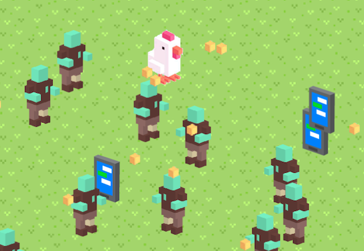
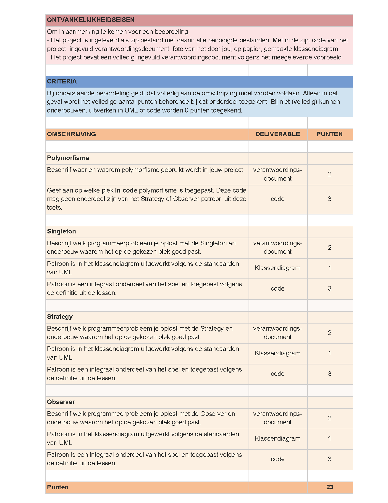

# PRG08 Chicken vs Zombies
Oefentoets voor programmeren 8. Verwerk hierin het strategy, singleton en observer pattern.

## Spelregels
- De kip beweegt naar de plek waar geklikt wordt. 
- Pak met de kip zo veel mogelijk graankorrels op. Elke korrel is een punt. 
- Wordt de kip geraakt door een zombie, dan is het game over. De kip en de zombies worden gereset en de score gaat terug naar 0
- Zombies bewegen standaard richting de kip en zijn aan het 'jagen'
- Pakt de kip een telefoon op, dan verdwijnt de telefoon. Ook krijgen alle zombies een nieuw Facebookbericht en blijven 2 seconden op dezelfde plek stil staan om naar hun telefoon te kijken. Na deze 2 seconden gaan ze automatisch weer jagen. 

## Startwaarden
- Kip begint op plek (0, 0)
- Zombies worden random in de onderste helft van het scherm geplaatst
- Telefoons worden willekeurig in het veld geplaatst, elke 5 seconden. Hiervoor kan je een counter gebruiken of de functie `setInterval(() => { // new Phone() }, 5000)`
- Graankorrels worden willekeurig in het veld geplaatst, elke 3 seconden. 

## Opdracht
Volgens de eisen uit de onderstaande beoordelingsciteria:
- Verwerk je de design patterns in een klassendiagram en verdere verantwoordelijkheden van de classes
- Werk je het spel uit volgens bovengenoemde spelregels in code
- Verwerk je in de code de design patterns
- Verwerk je jouw verantwoording in het document [verantwoordingsdocument.md](verantwoordingsdocument.md)

Lever je spullen in om hiermee te oefenen. 
- Maak een zip bestand van het geheel (code, klassendiagram en verantwoordingsdocument) en upload deze op Cumlaude. 
- Doe dit bij de inleveropdracht **Inleveropdracht Oefentoets**

